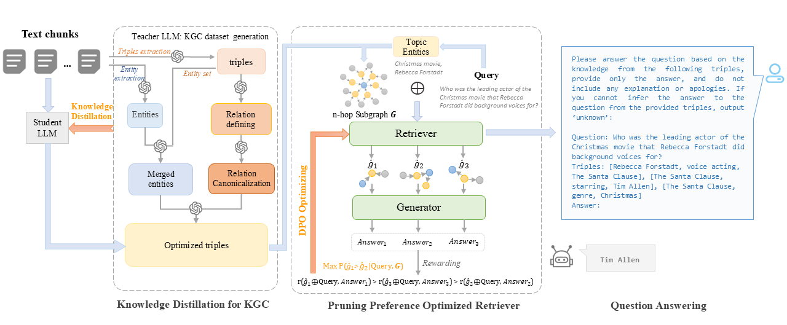

# KD-GAG

🌐 **项目主页** 

论文《KD-GAG: Knowledge-Distilled Graph-Augmented Generation via Preference-Aware Subgraph Pruning》的代码实现。

下图展示了我们提出的KD-GAG整体架构：



## 🛠️ 环境要求与安装

**安装依赖**
    请根据你的项目选择安装指令。

*   **使用 pip (推荐)：**
    ```bash
    pip install -r requirements.txt
    ```
*   **使用 conda：**
    ```bash
    conda install --file requirements.txt
    ```

## 🏃‍♂️ 快速开始

### 1. KGC知识蒸馏
*   **Step 1：教师模型生成训练数据**
    ```bash
    python distill/KGC_Teacher.py
    ```
*   **Step 2：规则过滤训练数据**
    ```bash
    python distill/kd_dataCheck.py
    ```
*   **Step 3：微调学生模型**
    ```bash
    python distill/kd_finetune.py --dataset [HotpotQA/2WikiMQA]\  
    --student [path/to/student_llm]\  
    --epoch [epoch]\  
    --batch_size [batch_size]\  
    --lr [learning_rate]
    ```   

### 2. 剪枝器DPO优化

*   **Step 1：剪枝结果采样** 
    ```bash
    python dpo/data_sampling.py --dataset [HotpotQA/2WikiMQA]\  
    --model_path [path/to/pruner_llm]\  
    --encoder_path [path/to/embedding model]\  
    --use_vllm\  
    --save_file [save_file.json]\  
    --device [cuda]\  
    --batch_size [batch_size]
    ```

*   **Step 2: 采样数据过滤**
    ```bash
    python dpo/data_filtering.py
    ```

*   **Step 3: DPO 训练**
    ```bash
    python dpo/train.py
    ```

### 3. 问答推理

*   **Step 1：KGC** 
    ```bash
    python main.py --mode kgc\  
    --dataset [HotpotQA/2WikiMQA]  
    --kgc_model [path/to/fine-tuned student_llm]\  
    --kgc_checkpoint [checkpoint of fine-tuned student_llm]
    ```

*   **Step 2: 检索问答**
    ```bash
    python main.py --mode rag\  
    --kgc_model [path/to/fine-tuned student_llm]\  
    --pruner [path/to/optimized pruning_llm]\  
    --pruner_checkpoint [checkpoint of fine-tuned pruning_llm]
    ```

*   **Step 3: 测评结果**
    ```bash
    python utils/eval.py --dataset [HotpotQA/2WikiMQA]\  
    --version [path/to/results.json]
    ```